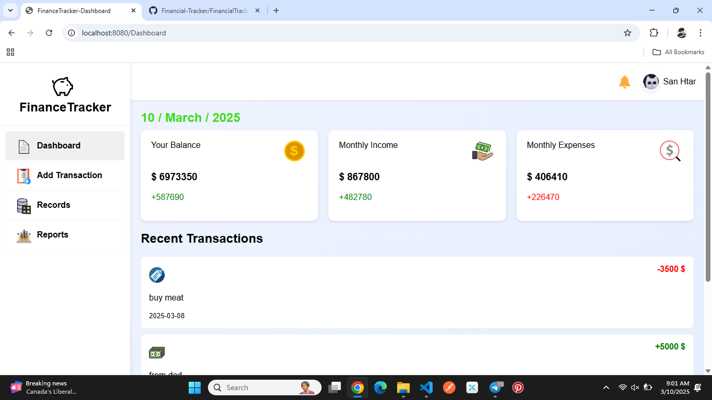
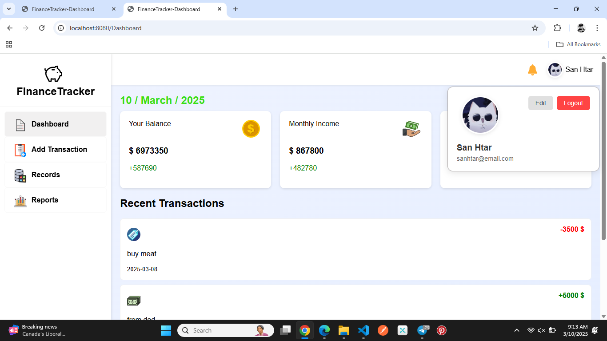
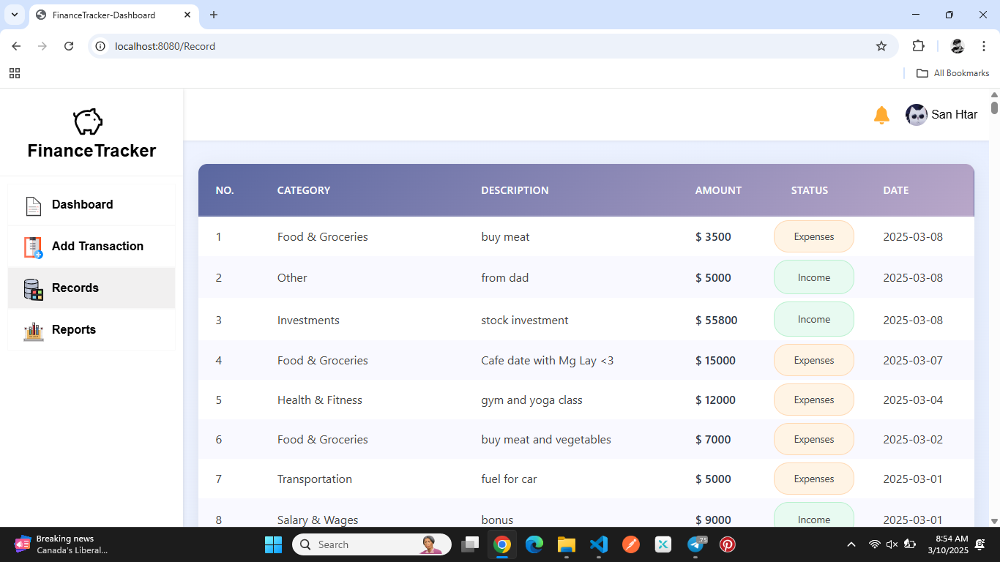

# Financial Tracker 💸

Track personal financial data. Provide user authentication. Save each transactions of user and categorize them in to suitable titles.

## Include :

1.Calculation of increment and decrement in the balance of user after each transaction

2.Calculate and updates the monthly income and expenses of user after each month

## Provide :

1.Visualized dashboard of current balance, latest monthly income and expenses results, and recent transactions

2.Display the chart of user's monthly income and expenses datas for every month

3.Display each user's transaction as report table

## Used language 🍵

Frontend : html,css,js

Backend : java,Spring boot

Database : mysql

## Images 🖼️

    

    

    
